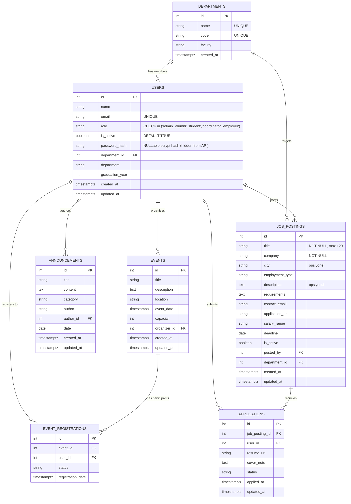

# 📊 Alumni Tracking System - Veri Tasarım Dokümanı (Data Design Documentation - DDD)

Bu doküman, **Alumni Tracking System** projesinin PostgreSQL ilişkisel veri tabanı şemasını, tablolar arası ilişkileri ve iş/doğrulama kurallarını sunmaktadır.

---

## 1. 🎯 Dokümanın Amacı ve Statüsü

- **Amaç:** Sistemdeki tüm varlıkların (`departments`, `users`, `announcements`, `events`, `event_registrations`, `job_postings`, `applications`) PostgreSQL ilişkisel veritabanı (RDBMS) şema standartlarını, rol tabanlı kullanıcı yetkilendirme (RBAC) modelini, referans bütünlüğünü, sıralı SQL migration (`backend/migrations/`), seed (`backend/seeds/`) ve alan doğrulama kurallarını (domain rules) tek merkezde dokümante etmektir.
- **Statü:** **Güncel Mimari, Roller, Güvenli Şifreleme & Domain Tasarımı (v1.2)**. Tüm çekirdek tablolar, kullanıcı rolleri (`admin`, `alumni`, `student`, `coordinator`, `employer`), yetki matrisi (RBAC), `crypto.scrypt` tabanlı güvenli şifreleme modeli (`password_hash`), PostgreSQL migration şemaları, veri modelleri (`backend/src/models/`) ve doğrulama kuralları (Bölüm 6) ile birlikte tanımlanmıştır.

---

## 2. 🔍 Kapsam (Scope)

Mevcut projede yer alan modeller ve bunları destekleyen temel işlevsel tablolar ele alınmıştır:

1. **`users` (Mezunlar / Kullanıcılar ve Roller):** Sistemdeki mezunları, öğrencileri, koordinatörleri, işverenleri ve yöneticileri rol tabanlı yetkilendirme (Role-Based Access Control - RBAC) altyapısıyla tutan temel kullanıcı varlığı.
2. **`announcements` (Duyurular):** Mevcut `announcementModel.js` ile birebir uyumlu duyuru ve haber varlığı.
3. **`departments` (Bölümler):** Mezunların ve öğrencilerin mezun oldukları akademik birimleri normalize eden tamamlayıcı varlık.
4. **`events` (Etkinlikler):** Mezun buluşmaları, seminerler, paneller ve kariyer günlerini yöneten etkinlik varlığı.
5. **`event_registrations` (Etkinlik Kayıtları):** Mezunların etkinliklere katılım durumlarını takip eden çoka-çok (N-N) ilişki bağlayıcı varlığı.
6. **`job_postings` (İş İlanları):** Mezunların ve paydaş kurumların staj, tam zamanlı veya yarı zamanlı kariyer fırsatlarını paylaştığı iş ilanları varlığı.
7. **`applications` (İş Başvuruları):** Mezunların sistemdeki iş ilanlarına yaptıkları başvuruları, durumlarını (beklemede, incelendi, mülakat, kabul, red) ve özgeçmiş bilgilerini takip eden çoka-çok (N-N) ilişki bağlayıcı varlığı.

---

## 3. 📑 Tablo ve Alan Tanımları (Data Dictionary)

### 3.1. `departments` (Bölümler Tablosu)
Üniversite bünyesindeki akademik birimleri ve fakülteleri temsil eder.

| Alan Adı | Veri Tipi | Zorunluluk | Kısıtlar (Constraints) | Açıklama |
|---|---|---|---|---|
| `id` | `SERIAL` | Zorunlu | `PRIMARY KEY` | Benzersiz bölüm kimlik numarası |
| `name` | `VARCHAR(100)` | Zorunlu | `NOT NULL`, `UNIQUE` | Bölümün tam adı (Örn: "Bilgisayar Mühendisliği") |
| `code` | `VARCHAR(20)` | Zorunlu | `NOT NULL`, `UNIQUE` | Bölüm kısa kodu (Örn: "CENG", "IE") |
| `faculty` | `VARCHAR(100)` | Zorunlu | `NOT NULL` | Bağlı olduğu fakülte (Örn: "Mühendislik Fakültesi") |
| `created_at` | `TIMESTAMPTZ` | Zorunlu | `NOT NULL`, `DEFAULT CURRENT_TIMESTAMP` | Kaydın sisteme eklenme zamanı |

---

### 3.2. `users` (Mezunlar / Kullanıcılar Tablosu)
Sistemdeki mezunların, öğrencilerin, koordinatörlerin, işverenlerin ve sistem yöneticilerinin kişisel, akademik ve rol yetkilendirme bilgilerini tutar. `userModel.js` modeli ile tam uyumludur.

| Alan Adı | Veri Tipi | Zorunluluk | Kısıtlar (Constraints) | Açıklama |
|---|---|---|---|---|
| `id` | `SERIAL` | Zorunlu | `PRIMARY KEY` | Benzersiz kullanıcı / mezun kimlik numarası (`userModel.js` `id`) |
| `name` | `VARCHAR(100)` | Zorunlu | `NOT NULL` | Kullanıcının ad ve soyadı (`userModel.js` `name`) |
| `email` | `VARCHAR(255)` | Zorunlu | `NOT NULL`, `UNIQUE` | Kullanıcının benzersiz kurumsal/kişisel e-posta adresi (`userModel.js` `email`) |
| `role` | `VARCHAR(30)` | Zorunlu | `NOT NULL`, `DEFAULT 'alumni'`, `CHECK (role IN ('admin', 'alumni', 'student', 'coordinator', 'employer'))` | Kullanıcının sistemdeki rolü ve erişim yetkisi (`userModel.js` `role`) |
| `is_active` | `BOOLEAN` | Zorunlu | `NOT NULL`, `DEFAULT TRUE` | Kullanıcı hesabının aktif olup olmadığı (hesap dondurma / engelleme için) |
| `password_hash` | `VARCHAR(255)` | Opsiyonel | `NULL` | Node.js `crypto.scrypt` ile tuzlanmış parola karması (`salt:key`). API ve görünüm katmanlarında ASLA döndürülmez. |
| `department_id` | `INTEGER` | Opsiyonel | `FOREIGN KEY` ➔ `departments(id)` `ON DELETE SET NULL` | Kullanıcının bağlı olduğu akademik bölümün referansı |
| `department` | `VARCHAR(100)` | Opsiyonel | `NULL` | Geriye dönük uyumluluk ve serbest metin alanı (`userModel.js` `department`) |
| `graduation_year` | `INTEGER` | Zorunlu | `NOT NULL`, `CHECK (graduation_year BETWEEN 1950 AND 2100)` | Mezuniyet yılı veya beklenen mezuniyet dönemi (`userModel.js` `graduationYear`) |
| `created_at` | `TIMESTAMPTZ` | Zorunlu | `NOT NULL`, `DEFAULT CURRENT_TIMESTAMP` | Kayıt tarihi (`userModel.js` `createdAt`) |
| `updated_at` | `TIMESTAMPTZ` | Opsiyonel | `NULL` | Son güncellenme tarihi (`userModel.js` `updatedAt`) |

#### 3.2.1. Sistemdeki Kullanıcı Rolleri ve Sorumlulukları (User Roles Hierarchy)

Sistemde güvenlik, veri gizliliği ve iş akışı ayrımını sağlamak amacıyla 5 farklı kullanıcı rolü tanımlanmıştır:

1. **`admin` (Sistem Yöneticisi):**
   - **Tanım:** Üniversite Bilgi İşlem Daire Başkanlığı veya Mezunlar Ofisi sistem yöneticilerini temsil eder.
   - **Sorumluluklar:** Platformun genel idaresi, kullanıcı hesaplarının oluşturulması/silinmesi, rollerin atanması ve değiştirilmesi, hesapların dondurulması (`is_active = FALSE`), bölümlerin (`departments`) yönetimi ve tüm veriler üzerinde tam denetim (Full Access).
   - **Sınırlar:** Kural dışı doğrudan başvuru oluşturma gibi süreçleri kullanıcı adına işletmez; sistem audit ve moderasyon görevini üstlenir.

2. **`alumni` (Mezun - Varsayılan Rol):**
   - **Tanım:** İstanbul Üniversitesi'nden mezun olmuş ve diplomaya hak kazanmış standart mezun kullanıcılardır.
   - **Sorumluluklar:** Kendi profil bilgilerini güncelleme, mezunlar dizininde arama yapma, diğer mezunların profillerini inceleme, üniversite duyurularını ve etkinliklerini takip etme, etkinliklere kayıt olma (`event_registrations`), kariyer ve staj ilanlarına başvuruda bulunma (`applications`), başvuru durumunu izleme ve kendi firması/birimi adına diğer mezunlara yönelik iş fırsatları paylaşma (`job_postings`).
   - **Sınırlar:** Diğer mezunların verilerini değiştiremez, kurumsal duyuru yayınlayamaz, sistem bölümlerini yönetemez.

3. **`student` (Öğrenci):**
   - **Tanım:** Üniversitenin lisans, yüksek lisans veya doktora programlarında halen aktif eğitim gören öğrencilerdir (`graduation_year >= CURRENT_YEAR`).
   - **Sorumluluklar:** Mezunlar dizinini ve öne çıkan mezunları inceleyerek kariyer rehberliği alma, staj ve giriş seviyesi iş ilanlarına başvurma (`applications`), kampüs etkinliklerine ve kariyer günlerine katılma (`event_registrations`).
   - **Sınırlar:** İlan yayınlayamaz (`job_postings`), kurumsal duyuru giremez, mezun olduğunda rolü yönetici veya mezuniyet otomasyonu ile `alumni` seviyesine güncellenir.

4. **`coordinator` (Akademisyen / Bölüm Koordinatörü):**
   - **Tanım:** Fakülte ve bölümlerin mezun ilişkilerinden sorumlu öğretim üyeleri veya bölüm koordinatörleridir.
   - **Sorumluluklar:** Kendi akademik bölümüne veya genel mezunlara yönelik resmi duyurular (`announcements`) yayınlama, bölüm mezunlar buluşması, panel veya seminer etkinlikleri (`events`) oluşturma ve organize etme, kendi bölümünün mezun kayıtlarını doğrulama.
   - **Sınırlar:** Diğer bölümlerin verilerini silemez, sistem yöneticisi yetkilerine sahip değildir.

5. **`employer` (İşveren / Kurum Temsilcisi):**
   - **Tanım:** Üniversite ile iş birliği yapan şirketlerin, teknokent firmalarının ve partner kurumların İnsan Kaynakları temsilcileridir.
   - **Sorumluluklar:** Üniversite mezun ve öğrencilerine yönelik iş, staj ve proje ilanları oluşturma (`job_postings`), kendi ilanlarına gelen başvuruları (`applications`) ve aday özgeçmişlerini inceleme, başvuru durumlarını (`reviewed`, `interview`, `accepted`, `rejected`) güncelleme.
   - **Sınırlar:** Mezunların kişisel iletişim bilgilerine yalnızca başvuru kapsamında erişebilir; duyuru, etkinlik veya genel kullanıcı yönetimi yapamaz.

#### 3.2.2. Rol Tabanlı Yetki Matrisi (Role-Based Access Control - RBAC Matrix)

| Modül / Varlık | İşlem (Operation) | `admin` | `alumni` | `student` | `coordinator` | `employer` |
|---|---|:---:|:---:|:---:|:---:|:---:|
| **Kullanıcılar (`users`)** | Kendi Profilini Görüntüleme / Güncelleme | ✅ | ✅ | ✅ | ✅ | ✅ |
| | Mezunlar Dizinini Arama / Listeleme | ✅ | ✅ | ✅ | ✅ | ❌ *(Kısıtlı)* |
| | Yeni Kullanıcı Ekleme / Silme | ✅ | ❌ | ❌ | ❌ | ❌ |
| | Kullanıcı Rolü & Aktiflik Değiştirme | ✅ | ❌ | ❌ | ❌ | ❌ |
| **Bölümler (`departments`)** | Bölümleri Listeleme / Detay Görme | ✅ | ✅ | ✅ | ✅ | ✅ |
| | Bölüm Ekleme / Güncelleme / Silme | ✅ | ❌ | ❌ | ❌ | ❌ |
| **Duyurular (`announcements`)** | Duyuruları Okuma / Görüntüleme | ✅ | ✅ | ✅ | ✅ | ✅ |
| | Duyuru Yayınlama / Güncelleme / Silme | ✅ *(Tümü)* | ❌ | ❌ | ✅ *(Yetkili)* | ❌ |
| **Etkinlikler (`events`)** | Etkinlikleri Listeleme & İnceleme | ✅ | ✅ | ✅ | ✅ | ✅ |
| | Etkinlik Oluşturma / Düzenleme | ✅ *(Tümü)* | ❌ | ❌ | ✅ *(Yetkili)* | ❌ |
| | Etkinliğe Kayıt Olma (`event_registrations`)| ✅ | ✅ | ✅ | ✅ | ❌ |
| **İş İlanları (`job_postings`)** | İlanları Listeleme & Arama | ✅ | ✅ | ✅ | ✅ | ✅ |
| | Yeni İlan Yayınlama | ✅ | ✅ | ❌ | ✅ | ✅ |
| | İlan Düzenleme & Silme | ✅ *(Tümü)* | ✅ *(Kendi)* | ❌ | ✅ *(Kendi)* | ✅ *(Kendi)* |
| **İş Başvuruları (`applications`)** | İlana Başvuru Yapma (`POST`) | ❌ *(Test)* | ✅ | ✅ | ❌ | ❌ |
| | Kendi Başvurularını Görüntüleme | ✅ *(Tümü)* | ✅ *(Kendi)* | ✅ *(Kendi)* | ❌ | ❌ |
| | Aday Başvurularını İnceleme & Durum Güncelleme | ✅ *(Tümü)* | ✅ *(Kendi İlanı)*| ❌ | ❌ | ✅ *(Kendi İlanı)*|
| | Başvuruyu Silme / Geri Çekme | ✅ | ✅ *(Kendi)* | ✅ *(Kendi)* | ❌ | ❌ |

---

### 3.3. `announcements` (Duyurular Tablosu)
Üniversite veya mezunlar ofisi tarafından yayınlanan duyuru ve haberleri saklar. `announcementModel.js` ile tam uyumludur.

| Alan Adı | Veri Tipi | Zorunluluk | Kısıtlar (Constraints) | Açıklama |
|---|---|---|---|---|
| `id` | `SERIAL` | Zorunlu | `PRIMARY KEY` | Benzersiz duyuru kimlik numarası (`announcementModel.js` `id`) |
| `title` | `VARCHAR(255)` | Zorunlu | `NOT NULL` | Duyuru başlığı (`announcementModel.js` `title`) |
| `content` | `TEXT` | Zorunlu | `NOT NULL` | Duyurunun detaylı metni (`announcementModel.js` `content`) |
| `category` | `VARCHAR(50)` | Zorunlu | `NOT NULL`, `DEFAULT 'Genel'` | Kategori (Örn: Etkinlik, Kariyer, Burs - `announcementModel.js` `category`) |
| `author` | `VARCHAR(100)` | Zorunlu | `NOT NULL`, `DEFAULT 'Yönetim'` | Duyuruyu yayınlayan birim veya yetkili metni (`announcementModel.js` `author`) |
| `author_id` | `INTEGER` | Opsiyonel | `FOREIGN KEY` ➔ `users(id)` `ON DELETE SET NULL` | Duyuruyu sisteme giren mezun/yetkili kullanıcı referansı |
| `date` | `DATE` | Zorunlu | `NOT NULL`, `DEFAULT CURRENT_DATE` | Duyuru yayın tarihi (`announcementModel.js` `date`) |
| `created_at` | `TIMESTAMPTZ` | Zorunlu | `NOT NULL`, `DEFAULT CURRENT_TIMESTAMP` | Oluşturulma zaman damgası (`announcementModel.js` `createdAt`) |
| `updated_at` | `TIMESTAMPTZ` | Opsiyonel | `NULL` | Son güncelleme zaman damgası (`announcementModel.js` `updatedAt`) |

---

### 3.4. `events` (Etkinlikler Tablosu)
Düzenlenen mezun buluşmaları, seminerler, atölyeler ve etkinlikleri temsil eder.

| Alan Adı | Veri Tipi | Zorunluluk | Kısıtlar (Constraints) | Açıklama |
|---|---|---|---|---|
| `id` | `SERIAL` | Zorunlu | `PRIMARY KEY` | Benzersiz etkinlik kimlik numarası |
| `title` | `VARCHAR(255)` | Zorunlu | `NOT NULL` | Etkinlik başlığı |
| `description` | `TEXT` | Zorunlu | `NOT NULL` | Etkinlik açıklaması ve programı |
| `location` | `VARCHAR(255)` | Zorunlu | `NOT NULL` | Fiziksel mekan (Örn: "Ana Kampüs Oditoryum") veya sanal toplantı linki |
| `event_date` | `TIMESTAMPTZ` | Zorunlu | `NOT NULL` | Etkinliğin gerçekleşeceği tarih ve saat |
| `capacity` | `INTEGER` | Opsiyonel | `CHECK (capacity > 0)` | Maksimum katılımcı kontenjanı |
| `organizer_id` | `INTEGER` | Opsiyonel | `FOREIGN KEY` ➔ `users(id)` `ON DELETE SET NULL` | Etkinliği organize eden mezun veya yönetici |
| `created_at` | `TIMESTAMPTZ` | Zorunlu | `NOT NULL`, `DEFAULT CURRENT_TIMESTAMP` | Oluşturulma tarihi |
| `updated_at` | `TIMESTAMPTZ` | Opsiyonel | `NULL` | Son güncelleme tarihi |

---

### 3.5. `event_registrations` (Etkinlik Kayıtları / Katılım Tablosu)
Mezunların etkinliklere kayıtlarını ve katılım durumlarını tutan ara (junction) tablodur.

| Alan Adı | Veri Tipi | Zorunluluk | Kısıtlar (Constraints) | Açıklama |
|---|---|---|---|---|
| `id` | `SERIAL` | Zorunlu | `PRIMARY KEY` | Benzersiz kayıt numarası |
| `event_id` | `INTEGER` | Zorunlu | `FOREIGN KEY` ➔ `events(id)` `ON DELETE CASCADE` | Kayıt olunan etkinlik |
| `user_id` | `INTEGER` | Zorunlu | `FOREIGN KEY` ➔ `users(id)` `ON DELETE CASCADE` | Kayıt olan mezun |
| `registration_date` | `TIMESTAMPTZ` | Zorunlu | `NOT NULL`, `DEFAULT CURRENT_TIMESTAMP` | Kayıt oluşturulma zamanı |
| `status` | `VARCHAR(30)` | Zorunlu | `NOT NULL`, `DEFAULT 'registered'`, `CHECK (status IN ('registered', 'attended', 'cancelled'))` | Katılım durumu (`registered`: Kayıtlı, `attended`: Katıldı, `cancelled`: İptal) |
| - | - | - | `UNIQUE (event_id, user_id)` | Bir mezunun aynı etkinliğe mükerrer kayıt yapmasını engeller |

---

### 3.6. `job_postings` (İş İlanları Tablosu)
Mezunlar ve işverenler tarafından paylaşılan iş, staj ve proje bazlı kariyer fırsatlarını saklar.

| Alan Adı | Veri Tipi | Zorunluluk | Kısıtlar (Constraints) | Açıklama |
|---|---|---|---|---|
| `id` | `SERIAL` | Zorunlu | `PRIMARY KEY` | Benzersiz iş ilanı kimlik numarası |
| `title` | `VARCHAR(120)` | Zorunlu | `NOT NULL`, `CHECK (char_length(trim(title)) BETWEEN 3 AND 120)` | Pozisyon / İlan başlığı (Zorunlu, boşluk temizlendikten sonra en az 3, en fazla 120 karakter) |
| `company` | `VARCHAR(150)` | Zorunlu | `NOT NULL`, `CHECK (char_length(trim(company)) BETWEEN 2 AND 150)` | İlanı veren şirket veya kurum adı (Zorunlu, en fazla 150 karakter) |
| `city` | `VARCHAR(100)` | Opsiyonel | `NULL` | Çalışma şehri / lokasyonu (Opsiyonel; Örn: "İstanbul", "Ankara", "Remote" — mevcut `006` migration şemasında `location` sütunuyla eşleşir) |
| `employment_type` | `VARCHAR(50)` | Zorunlu | `NOT NULL`, `DEFAULT 'full-time'`, `CHECK (employment_type IN ('full-time', 'part-time', 'internship', 'contract', 'remote'))` | Çalışma şekli / istihdam türü |
| `description` | `TEXT` | Opsiyonel | `NULL` | İş tanımı, görev ve sorumluluklar (Opsiyonel; girildiğinde en fazla 5.000 karakter) |
| `requirements` | `TEXT` | Opsiyonel | `NULL` | Aranan nitelikler, teknik yetkinlikler ve deneyim şartları (En fazla 3.000 karakter) |
| `contact_email` | `VARCHAR(255)` | Opsiyonel | `NULL` | Başvuru ve iletişim için e-posta adresi (Girildiğinde geçerli e-posta formatında olmalı) |
| `application_url` | `VARCHAR(500)` | Opsiyonel | `NULL` | Doğrudan harici başvuru bağlantısı (Girildiğinde `http://` veya `https://` ile başlamalı) |
| `salary_range` | `VARCHAR(100)` | Opsiyonel | `NULL` | Belirtilmişse maaş / ücret aralığı (Örn: "40.000 - 60.000 TL") |
| `deadline` | `DATE` | Opsiyonel | `NULL` | İlanın son başvuru tarihi (Yeni kayıtlarda geçmiş bir tarih olamaz) |
| `is_active` | `BOOLEAN` | Zorunlu | `NOT NULL`, `DEFAULT TRUE` | İlanın aktif/yayında olup olmadığı |
| `posted_by` | `INTEGER` | Opsiyonel | `FOREIGN KEY` ➔ `users(id)` `ON DELETE SET NULL` | İlanı oluşturan/yayınlayan mezun veya yetkili kullanıcı |
| `department_id` | `INTEGER` | Opsiyonel | `FOREIGN KEY` ➔ `departments(id)` `ON DELETE SET NULL` | İlanın öncelikli olarak hedeflendiği akademik bölüm (opsiyonel filtreleme için) |
| `created_at` | `TIMESTAMPTZ` | Zorunlu | `NOT NULL`, `DEFAULT CURRENT_TIMESTAMP` | İlanın sisteme eklendiği tarih ve saat |
| `updated_at` | `TIMESTAMPTZ` | Opsiyonel | `NULL` | İlanın son güncellenme zaman damgası |

---

### 3.7. `applications` (İş Başvuruları Tablosu)
Mezunların yayınlanmış iş ilanlarına yaptıkları başvuruları ve başvuru süreçlerini tutan ara tablodur.

| Alan Adı | Veri Tipi | Zorunluluk | Kısıtlar (Constraints) | Açıklama |
|---|---|---|---|---|
| `id` | `SERIAL` | Zorunlu | `PRIMARY KEY` | Benzersiz başvuru kimlik numarası |
| `job_posting_id` | `INTEGER` | Zorunlu | `FOREIGN KEY` ➔ `job_postings(id)` `ON DELETE CASCADE` | Başvuru yapılan iş ilanı |
| `user_id` | `INTEGER` | Zorunlu | `FOREIGN KEY` ➔ `users(id)` `ON DELETE CASCADE` | Başvuruyu yapan mezun |
| `resume_url` | `VARCHAR(500)` | Opsiyonel | `NULL` | Başvuruya eklenen özgeçmiş / CV bağlantısı (URL) |
| `cover_note` | `TEXT` | Opsiyonel | `NULL` | Başvuru ön yazısı / adayın açıklaması |
| `status` | `VARCHAR(30)` | Zorunlu | `NOT NULL`, `DEFAULT 'pending'`, `CHECK (status IN ('pending', 'reviewed', 'interview', 'accepted', 'rejected'))` | Başvuru değerlendirme durumu |
| `applied_at` | `TIMESTAMPTZ` | Zorunlu | `NOT NULL`, `DEFAULT CURRENT_TIMESTAMP` | Başvuru yapılma zamanı |
| `updated_at` | `TIMESTAMPTZ` | Opsiyonel | `NULL` | Başvuru durumu son güncellenme zaman damgası |
| - | - | - | `UNIQUE (job_posting_id, user_id)` | Bir mezunun aynı ilana mükerrer başvuru yapmasını engeller |

---

## 4. 🔗 Tablolar Arası İlişkiler (Entity Relationships)

Sistemdeki varlıklar arasındaki ana ilişkiler ve foreign key mekanizmaları aşağıda açıklanmıştır:

1. **`departments` ➔ `users` (Bire-Çok / 1:N):**
   - Her bölümün bünyesinde birden çok mezun bulunabilir (`1:N`).
   - Bir mezun tek bir bölüme aittir (`users.department_id ➔ departments.id`).
   - Bölüm silindiğinde mezun kaydının silinmemesi için `ON DELETE SET NULL` stratejisi benimsenmiştir.

2. **`users` ➔ `announcements` (Bire-Çok / 1:N):**
   - Yalnızca yetkili kullanıcılar (`admin` veya `coordinator` rolündeki kullanıcılar) kurumsal duyuru yayınlayabilir (`1:N`).
   - Duyuru tablosundaki `author_id` alanı, duyuruyu oluşturan yetkili kullanıcıyı referans alır.
   - Kullanıcı silinse dahi kamuya açık duyurunun sistemde kalması için `ON DELETE SET NULL` uygulanır; `author` metin alanı korunur.

3. **`users` ➔ `events` (Bire-Çok / 1:N - Organizatörlük):**
   - Bir yetkili veya koordinatör (`admin` veya `coordinator`) birden fazla etkinliği organize edebilir (`1:N`).
   - `events.organizer_id ➔ users.id` ilişkisiyle organizatör belirlenir.
   - Organizatör silindiğinde etkinlik varlığını korur (`ON DELETE SET NULL`).

4. **`users` ➔ `events` (Çoka-Çok / N:N - Katılım İlişkisi):**
   - Bir mezun veya öğrenci (`alumni`, `student`, vb.) birden çok etkinliğe katılabilir; bir etkinliğe birden çok kullanıcı kayıt olabilir (`N:N`).
   - Bu çoka-çok ilişki `event_registrations` ara tablosu ile normalize edilmiştir.
   - Etkinlik veya kullanıcı silindiğinde, ilişkili katılım kaydının anlamsızlaşmaması için `ON DELETE CASCADE` kuralı uygulanır.
   - `UNIQUE(event_id, user_id)` kısıtı ile mükerrer kayıtlar engellenir.

5. **`users` ➔ `job_postings` (Bire-Çok / 1:N):**
   - Bir mezun, işveren, koordinatör veya yönetici (`alumni`, `employer`, `coordinator`, `admin`) birden fazla iş ilanı paylaşabilir (`1:N`).
   - `job_postings.posted_by ➔ users.id` ilişkisi ile ilanı yayınlayan kullanıcı eşleştirilir.
   - İlanı oluşturan kullanıcının hesabı silinse bile, ilanın sistemdeki geçmişi ve arşiv bütünlüğünü korumak adına `ON DELETE SET NULL` stratejisi uygulanır.

6. **`departments` ➔ `job_postings` (Bire-Çok / 1:N - Opsiyonel Hedefleme):**
   - Bir akademik bölüm veya fakülteye özel olarak birden fazla iş ilanı hedeflenebilir (`1:N`).
   - `job_postings.department_id ➔ departments.id` ilişkisi ile belirli bir bölüm mezunlarına yönelik hedefli ilan filtrelemesi sağlanır.
   - Bölüm kaydı silindiğinde ilan silinmez, yalnızca bölüm ilişkisi boşa çıkar (`ON DELETE SET NULL`).

7. **`job_postings` ➔ `applications` (Bire-Çok / 1:N):**
   - Bir iş ilanına birden fazla mezun veya öğrenci başvurabilir (`1:N`).
   - `applications.job_posting_id ➔ job_postings.id` ilişkisiyle ilan eşleştirilir.
   - İlan silindiğinde ilişkili başvurular da temizlenir (`ON DELETE CASCADE`).

8. **`users` ➔ `applications` (Bire-Çok / 1:N):**
   - Bir mezun veya öğrenci (`alumni`, `student`) birden çok iş ilanına başvuruda bulunabilir (`1:N`).
   - `applications.user_id ➔ users.id` ilişkisiyle başvuran aday kullanıcı eşleştirilir.
   - Kullanıcı silindiğinde başvuruları da sistemden kaldırılır (`ON DELETE CASCADE`).

9. **`users` ➔ `job_postings` (Çoka-Çok / N:N - Başvuru İlişkisi):**
   - Mezunlar ve iş ilanları arasındaki başvuru ilişkisi `applications` ara tablosu üzerinden normalize edilmiştir.
   - `UNIQUE(job_posting_id, user_id)` kısıtı ile mükerrer başvurular engellenir.

---

## 5. 🗺️ Varlık Bağıntı Diyagramı (Mermaid ER Diagram)

```mermaid
erDiagram
    DEPARTMENTS ||--o{ USERS : "has members"
    DEPARTMENTS ||--o{ JOB_POSTINGS : "targets"
    USERS ||--o{ ANNOUNCEMENTS : "authors"
    USERS ||--o{ EVENTS : "organizes"
    USERS ||--o{ EVENT_REGISTRATIONS : "registers to"
    USERS ||--o{ JOB_POSTINGS : "posts"
    USERS ||--o{ APPLICATIONS : "submits"
    EVENTS ||--o{ EVENT_REGISTRATIONS : "has participants"
    JOB_POSTINGS ||--o{ APPLICATIONS : "receives"

    DEPARTMENTS {
        int id PK
        string name "UNIQUE"
        string code "UNIQUE"
        string faculty
        timestamptz created_at
    }

    USERS {
        int id PK
        string name
        string email "UNIQUE"
        string role "CHECK in ('admin','alumni','student','coordinator','employer')"
        boolean is_active "DEFAULT TRUE"
        string password_hash "NULLable scrypt hash (hidden from API)"
        int department_id FK
        string department
        int graduation_year
        timestamptz created_at
        timestamptz updated_at
    }

    ANNOUNCEMENTS {
        int id PK
        string title
        text content
        string category
        string author
        int author_id FK
        date date
        timestamptz created_at
        timestamptz updated_at
    }

    EVENTS {
        int id PK
        string title
        text description
        string location
        timestamptz event_date
        int capacity
        int organizer_id FK
        timestamptz created_at
        timestamptz updated_at
    }

    EVENT_REGISTRATIONS {
        int id PK
        int event_id FK
        int user_id FK
        string status
        timestamptz registration_date
    }

    JOB_POSTINGS {
        int id PK
        string title "NOT NULL, max 120"
        string company "NOT NULL"
        string city "opsiyonel"
        string employment_type
        text description "opsiyonel"
        text requirements
        string contact_email
        string application_url
        string salary_range
        date deadline
        boolean is_active
        int posted_by FK
        int department_id FK
        timestamptz created_at
        timestamptz updated_at
    }

    APPLICATIONS {
        int id PK
        int job_posting_id FK
        int user_id FK
        string resume_url
        text cover_note
        string status
        timestamptz applied_at
        timestamptz updated_at
    }
```

---

## 6. 🛡️ İş ve Doğrulama Kuralları (Domain & Validation Rules)

Bu bölüm, sistemdeki tüm varlıkların veri bütünlüğünü, iş mantığını (business logic) ve API/Web doğrulama standartlarını tanımlayan alan (domain) kurallarını içerir.

### 6.1. Genel (Tüm Varlıklar İçin Ortak) Kurallar
1. **Boşluk Temizleme (Whitespace Normalization):** Tüm metin alanlarında (`title`, `company`, `name`, `city`, vb.) kaydetme öncesi baştaki ve sondaki boşluklar (`trim`) temizlenir; yalnızca boşluk karakterlerinden oluşan girdiler boş kabul edilerek zorunlu alan kontrolünden geçirilir.
2. **Güvenli URL Kuralı:** Harici bağlantı barındıran tüm URL alanları (`application_url`, `resume_url`) yalnızca `http://` veya `https://` protokolü ile başlamalıdır (`javascript:`, `data:` vb. güvensiz şemalar kabul edilmez).
3. **E-Posta Normalizasyonu:** Tüm e-posta alanları geçerli e-posta formatına (`yerel@alan.uzantı`) uymalı ve tutarlılık için küçük harfe (`lowercase`) çevrilerek saklanmalıdır.
4. **Zaman Damgası Bütünlüğü:** `created_at` ve `applied_at` alanları kayıt oluşturma anında sistem tarafından UTC (`TIMESTAMPTZ`) olarak atanır ve dışarıdan değiştirilemez; `updated_at` ise yalnızca güncelleme işlemlerinde güncellenir.
5. **Sayfa Dışı / API Tutarlılığı:** İlişkisel (`FOREIGN KEY`) bir alana geçersiz veya sistemde bulunmayan bir ID gönderildiğinde `400 Bad Request` / `404 Not Found` veya referans hatası dönülmelidir; veritabanında yetim (orphan) kayıt oluşmasına izin verilmez.

---

### 6.2. `job_postings` (İş İlanları) Kuralları

#### A. Alan Zorunluluk ve Doğrulama Kuralları
1. **`title` (İlan Başlığı) — Zorunlu & Uzunluk Sınırı:**
   - Boş bırakılamaz (`NOT NULL`), yalnızca boşluklardan oluşamaz.
   - `trim` işlemi sonrasında **en az 3**, **en fazla 120 karakter** uzunluğunda olmalıdır (`VARCHAR(120)`).
2. **`company` (Şirket / Kurum Adı) — Zorunlu:**
   - Boş bırakılamaz (`NOT NULL`), yalnızca boşluklardan oluşamaz.
   - `trim` işlemi sonrasında **en az 2**, **en fazla 150 karakter** uzunluğunda olmalıdır.
3. **`city` (Şehir / Çalışma Lokasyonu) — Opsiyonel:**
   - Girilmesi zorunlu değildir (`NULL` olabilir; örn. tamamen uzaktan veya şehir belirtilmeyen ilanlar için).
   - Girilmesi halinde `trim` sonrasında **en az 2**, **en fazla 100 karakter** uzunluğunda olmalıdır. *(Not: Mevcut `006` SQL migration dosyasında bu alan `location` olarak adlandırılmıştır.)*
4. **`description` (İş Tanımı) — Opsiyonel:**
   - Girilmesi zorunlu değildir (`NULL` olabilir; yalnızca başlık, şirket ve özet/link ile hızlı ilan girilebilmesine izin verir).
   - Girilmesi halinde anlamlı içerik bütünlüğü için **en fazla 5.000 karakter** ile sınırlandırılır.
5. **`employment_type` (Çalışma Türü) — Zorunlu & Kısıtlı Değer:**
   - Boş bırakılırsa varsayılan olarak `'full-time'` atanır.
   - Yalnızca şu 5 değerden birini alabilir: `'full-time'`, `'part-time'`, `'internship'`, `'contract'`, `'remote'`.
6. **`requirements` (Aday Kriterleri) — Opsiyonel:**
   - Opsiyoneldir; girilmesi durumunda **en fazla 3.000 karakter** olabilir.
7. **`contact_email` (İletişim E-Postası) — Opsiyonel & Format:**
   - Opsiyoneldir; girildiği takdirde geçerli e-posta formatında olmalı ve **255 karakteri** geçmemelidir.
8. **`application_url` (Harici Başvuru Linki) — Opsiyonel & Format:**
   - Opsiyoneldir; girildiği takdirde `http://` veya `https://` ile başlayan geçerli bir URL olmalı ve **500 karakteri** geçmemelidir.
9. **`salary_range` (Maaş Aralığı) — Opsiyonel:**
   - Opsiyoneldir; girilmesi durumunda **en fazla 100 karakter** olabilir.
10. **`deadline` (Son Başvuru Tarihi) — Opsiyonel & Tarih Kuralı:**
    - Opsiyoneldir (`NULL` ise ilan süresiz kabul edilir).
    - Girildiğinde geçerli `YYYY-MM-DD` tarih formatında olmalıdır.
    - **Geçmiş Tarih Yasağı:** Yeni ilan oluşturma sırasında veya son başvuru tarihi güncellenirken bugünden önceki bir tarih (`deadline < CURRENT_DATE`) kabul edilmez.

#### B. İş Mantığı ve Yaşam Döngüsü Kuralları
11. **Varsayılan Aktiflik:** Yeni eklenen her ilan, aksi belirtilmedikçe `is_active = TRUE` olarak yayına alınır.
12. **Süresi Dolmuş İlan Kuralı:** `deadline` tarihi geçmiş (`deadline < CURRENT_DATE`) veya `is_active = FALSE` durumundaki ilanlar "kapalı/süresi dolmuş" kabul edilir; bu ilanlara yeni başvuru alınmaz.
13. **Referans Geçerliliği:** `posted_by` belirtilmişse `users` tablosunda, `department_id` belirtilmişse `departments` tablosunda mevcut bir kayda işaret etmelidir.
14. **Mükerrer İlan Önleme (Anti-Spam Önerisi):** Aynı şirket (`company`) ve aynı başlık (`title`) altında hâlihazırda aktif olan birebir aynı ilanın kısa süre içinde tekrarlanmaması önerilir.
15. **Arşiv ve Kaskad Silme Kuralı:** İlanı paylaşan kullanıcı sistemden silinse bile ilan kaydı silinmez (`posted_by = NULL` yapılır); ancak ilanın kendisi silindiğinde ona bağlı tüm başvurular (`applications`) otomatik olarak silinir (`ON DELETE CASCADE`).

---

### 6.3. `applications` (İş Başvuruları) Kuralları
1. **Zorunlu İlişkisel Alanlar:** `job_posting_id` ve `user_id` zorunludur ve veritabanında geçerli kayıtlara karşılık gelmelidir.
2. **Tekil Başvuru Kuralı (Duplicate Guard):** Bir mezun aynı iş ilanına yalnızca bir kez başvurabilir (`UNIQUE(job_posting_id, user_id)`).
3. **Açık İlan Şartı:** Yalnızca `is_active = TRUE` olan ve son başvuru tarihi (`deadline`) henüz geçmemiş olan ilanlara yeni başvuru oluşturulabilir.
4. **Kendi İlanına Başvuru Engeli:** İlanı yayınlayan kullanıcının (`job_postings.posted_by`), kendi yayınladığı ilana aday olarak başvurmasına izin verilmemesi önerilir.
5. **Özgeçmiş ve Ön Yazı Sınırları:**
   - `resume_url`: Opsiyoneldir; girilirse geçerli `http://` veya `https://` URL formatında ve en fazla **500 karakter** olmalıdır.
   - `cover_note`: Opsiyoneldir; girilirse **en fazla 2.000 karakter** olabilir.
6. **Durum (Status) ve Geçiş Kuralları:**
   - Yeni oluşturulan başvurular varsayılan olarak `'pending'` durumunda başlar.
   - İzin verilen durumlar: `'pending'`, `'reviewed'`, `'interview'`, `'accepted'`, `'rejected'`.
   - Nihai sonuca (`'accepted'` veya `'rejected'`) ulaşmış başvuruların durumu iş akışı gereği geriye dönük `'pending'` durumuna çekilemez.

---

### 6.4. `users` ve `departments` Kuralları

#### 6.4.1. `departments` (Bölümler) Kuralları
1. `name` zorunlu (2–100 karakter) ve sistemde benzersizdir.
2. `code` zorunlu (2–20 karakter) ve benzersizdir; büyük harf/alfanümerik kısa kod formatında (`CENG`, `IE`, `LAW`, vb.) tutulmalıdır.
3. `faculty` zorunlu (2–100 karakter) olmalıdır.

#### 6.4.2. `users` (Kullanıcılar) Alan ve Doğrulama Kuralları
1. **`name`:** Zorunlu (boşluk temizlendikten sonra 2–100 karakter, yalnızca boşluklardan oluşamaz).
2. **`email`:** Zorunlu, geçerli RFC 5322 e-posta formatında (`kullanici@alanadi.uzanti`), en fazla 255 karakter, küçük harfe (`lowercase`) normalize edilmiş ve sistem genelinde benzersizdir.
3. **`password` ve `passwordConfirm` (Kayıt Parolası Doğrulaması):**
   - Kayıt esnasında şifre zorunludur ve en az **8 karakter** uzunluğunda olmalıdır.
   - Formda `password` ve `passwordConfirm` olmak üzere iki ayrı alanda girilir ve iki alan birebir eşleşmelidir.
   - Parolalar ASLA düz metin (plaintext) olarak saklanmaz, URL parametrelerinde taşınmaz, hata mesajlarında ya da sunucu loglarında tutulmaz.
4. **`password_hash` (Kriptografik Parola Karması):**
   - Node.js'in yerleşik `crypto.scrypt` fonksiyonu, 16-byte (128-bit) kriptografik rastgele tuz (salt) ve 64-byte türetilmiş anahtar ile karma haline getirilir (`salt:derivedKeyHex`).
   - Sütun geriye dönük uyumluluk ve şifresi olmayan eski/test kullanıcıları için `NULL` (boş geçilebilir) olarak tanımlanmıştır (`009_add_password_hash_to_users.sql`).
   - `password_hash` ve düz metin parola değeri; `/api/users`, `/users` vb. hiçbir API cevabında, JSON çıktısında veya model nesnesinde (`formatUser`) ASLA dışarıya sızdırılmaz.
5. **`role` (Kullanıcı Rolü):**
   - Boş bırakılamaz (`NOT NULL`); belirtilmediğinde varsayılan olarak `'alumni'` atanır.
   - Yalnızca şu 5 geçerli rolden birini alabilir: `'admin'`, `'alumni'`, `'student'`, `'coordinator'`, `'employer'`.
6. **`is_active` (Hesap Aktiflik Durumu):**
   - Zorunlu boolean alandır; varsayılan değeri `TRUE`'dur.
   - `is_active = FALSE` olan hesaplar askıya alınmış/dondurulmuş kabul edilir; oturum açamaz ve yeni kayıt/başvuru aksiyonları tetikleyemez.
7. **`graduation_year`:** Zorunlu bir tam sayıdır ve **`1950` ile `2100` arasında** olmalıdır.
8. **`department_id`:** Opsiyoneldir; girildiğinde geçerli bir `departments.id` kaydına işaret etmelidir (`ON DELETE SET NULL`).

#### 6.4.3. Rol Tabanlı İş Mantığı ve Yetkilendirme Kuralları (RBAC Business Rules)
1. **Rol Değiştirme ve Yetki Yükseltme Koruması (Privilege Escalation Guard):**
   - Bir kullanıcının rolü yalnızca `admin` yetkisine sahip kullanıcılar tarafından değiştirilebilir. Normal kullanıcılar kendi kayıt veya profil güncelleme isteklerinde (`POST /users`, `PUT /api/users/:id`) rol alanını değiştiremez.
2. **Öğrenci-Mezun Rol Geçişi (Student Graduation Transition):**
   - `student` rolüyle kayıtlı bir kullanıcının mezuniyet yılı geldiğinde ve mezuniyeti doğrulandığında, sistem yöneticisi veya mezuniyet otomasyonu ile rolü `'alumni'` seviyesine yükseltilir; geçmiş başvuru ve etkinlik kayıtları aynen korunur.
3. **İş İlanı Yayınlama Kısıtı:**
   - Yalnızca `'admin'`, `'coordinator'`, `'employer'` ve `'alumni'` rollerine sahip kullanıcılar iş/staj ilanı oluşturabilir (`job_postings.posted_by`). Aktif `'student'` rolündeki kullanıcıların ilan yayınlamasına izin verilmez.
4. **Başvuru Yapma Kısıtı:**
   - Yalnızca `'alumni'` ve `'student'` rolündeki kullanıcılar iş ilanlarına aday olarak başvurabilir (`applications.user_id`). İlanı veren işveren (`employer`) veya sistem yöneticileri aday olarak başvuru gönderemez.
5. **Duyuru ve Etkinlik Yetkilendirmesi:**
   - Kurumsal duyuru (`announcements`) ve etkinlik (`events`) oluşturma yetkisi yalnızca `'admin'` ve akademik birim temsilcisi olan `'coordinator'` rollerine aittir.
6. **Aktiflik Kontrolü (Account Status Guard):**
   - `is_active = FALSE` durumundaki kullanıcıların oturum açma, yeni iş ilanı oluşturma, ilana başvurma veya etkinliğe kayıt olma talepleri reddedilir (`403 Forbidden`).

---

### 6.5. `announcements`, `events` ve `event_registrations` Kuralları
1. **`announcements` (Duyurular):**
   - `title` zorunlu (3–255 karakter), `content` zorunlu (boş olamaz, en fazla 10.000 karakter), `category` zorunlu (varsayılan `'Genel'`, en fazla 50 karakter), `author` zorunlu (varsayılan `'Yönetim'`, en fazla 100 karakter), `date` zorunludur (varsayılan `CURRENT_DATE`).
2. **`events` (Etkinlikler):**
   - `title` zorunlu (3–255 karakter), `description` zorunlu, `location` zorunlu (en fazla 255 karakter), `event_date` zorunludur (yeni etkinlik oluştururken geçmiş tarihli olmamalıdır).
   - `capacity` opsiyoneldir; belirtilirse pozitif tam sayı (`> 0`) olmalıdır.
3. **`event_registrations` (Etkinlik Kayıtları):**
   - Bir kullanıcı aynı etkinliğe tek sefer kayıt olabilir (`UNIQUE(event_id, user_id)`).
   - `status` yalnızca `'registered'`, `'attended'`, `'cancelled'` değerlerinden birini alabilir (varsayılan `'registered'`).
   - Etkinlik için `capacity` tanımlanmışsa ve aktif `'registered'` katılımcı sayısı kapasite sınırına ulaşmışsa yeni `'registered'` kaydı kabul edilmez.

---

## 7. 📌 Varsayımlar ve İleride Genişletilecek Alanlar

1. **Kimlik Doğrulama ve Parola Güvenliği (Authentication & Password Security):**
   - Rol tabanlı yetki mimarisi (`admin`, `alumni`, `student`, `coordinator`, `employer`), hesap aktiflik kontrolü (`is_active`) ve `crypto.scrypt` tabanlı güvenli şifreleme (`password_hash` sütunu ile `009_add_password_hash_to_users.sql` migration'ı) v1.2 ile tam olarak şemaya ve domain kurallarına dahil edilmiştir.
   - Gelecek aşamada JWT veya session tabanlı oturum yönetimi / kimlik doğrulama mekanizmaları entegre edilecektir.

2. **Mentorluk ve Kariyer Gelişim Modülü:**
   - Şemaya dahil edilen `job_postings` ve `applications` tablolarına ek olarak, yeni mezunlar ile kıdemli mezunlar arasında eşleşme ve kariyer rehberliği sağlamak için `mentorships` tablosu tasarlanabilir.

3. **İletişim ve Gizlilik Tercihleri:**
   - Mezunların e-posta veya profil bilgilerinin diğer kullanıcılara açık olup olmayacağını yöneten `privacy_settings` alanı eklenebilir.

4. **Veritabanı İndeksleme Stratejisi (Indexes):**
   - Sık sorgulanan alanlarda B-Tree indeksler planlanacaktır:
     - `CREATE INDEX idx_users_email ON users(email);`
     - `CREATE INDEX idx_announcements_date ON announcements(date DESC);`
     - `CREATE INDEX idx_events_date ON events(event_date ASC);`
     - `CREATE INDEX idx_job_postings_active ON job_postings(is_active, created_at DESC);`
     - `CREATE INDEX idx_job_postings_department ON job_postings(department_id);`
     - `CREATE INDEX idx_applications_job ON applications(job_posting_id);`
     - `CREATE INDEX idx_applications_user ON applications(user_id);`
     - `CREATE INDEX idx_applications_status ON applications(status);`

5. **PostgreSQL Geçişi, Migration ve Seed Altyapısı:**
   - Projede `pg.Pool` bağlantı havuzu [`backend/src/config/db.js`](backend/src/config/db.js) üzerinde yapılandırılmış ve aktif edilmiştir.
   - `001`–`007` arası sıralı `.sql` migration dosyaları [`backend/migrations/`](backend/migrations/) dizininde yer almakta ve [`backend/src/config/migrate.js`](backend/src/config/migrate.js) tarafından uygulama açılışında otomatik olarak uygulanmaktadır (`migrations` takip tablosu ile idempotent şekilde).
   - Başlangıç ve test verileri için factory tabanlı seed altyapısı [`backend/seeds/`](backend/seeds/) altında çalışmaktadır.

6. **Uygulama Katmanı Gözlemlenebilirlik ve Hata Loglama:**
   - Route/metod uyuşmazlıkları (`404 Guardian`) ve sunucu/veritabanı katmanı hataları (`5xx Guardian`, `pg` `AggregateError` dahil) uygulama katmanında [`backend/src/utils/errorLogger.js`](backend/src/utils/errorLogger.js) aracılığıyla `backend/logs/error.logs` dosyasına kaydedilir.
